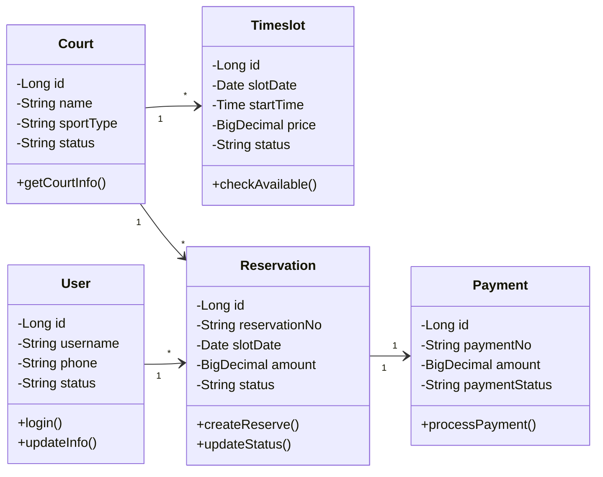
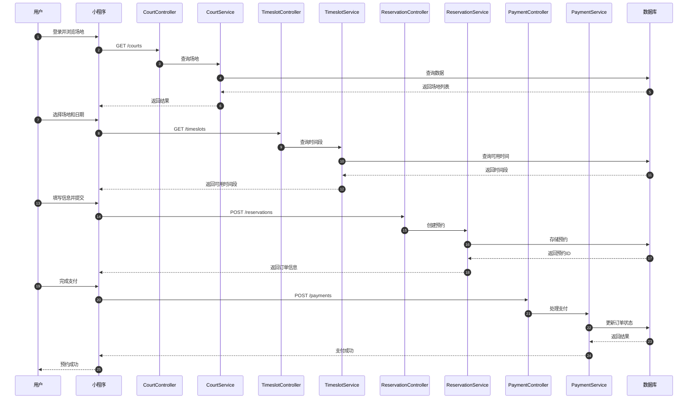
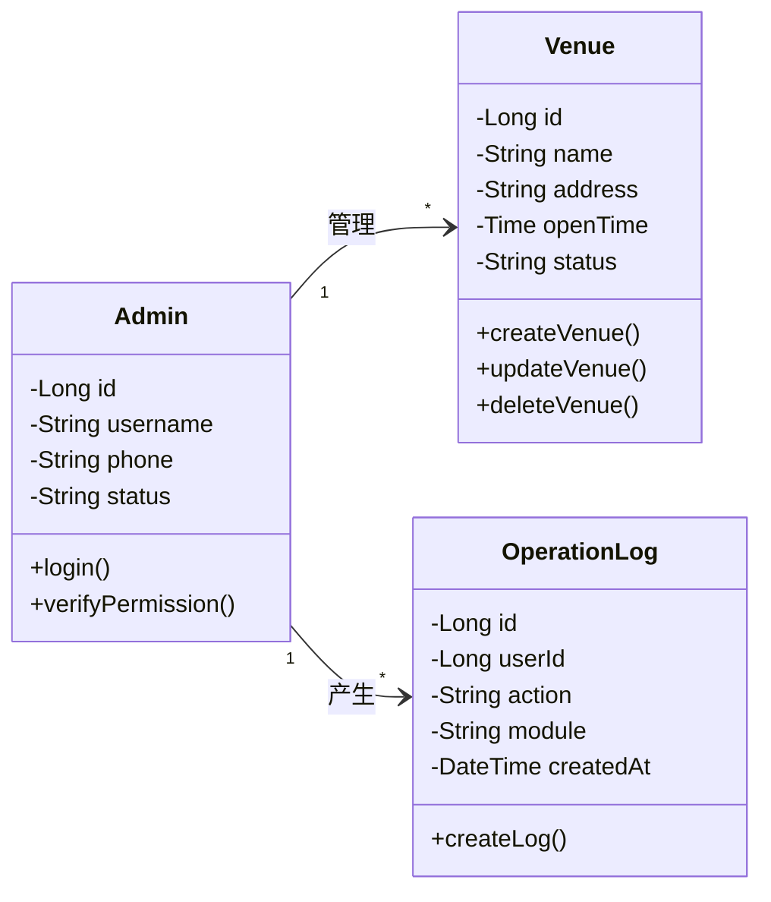
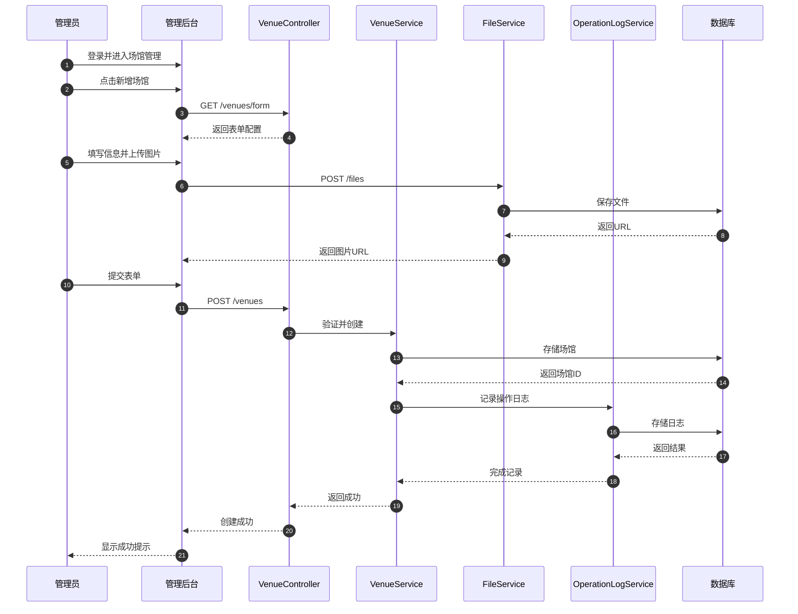

# 体育馆场地预约系统业务场景设计图

## 图4.1 用户预约场地类图

## 图4.2 用户预约场地时序图

## 图4.3 场馆管理类图

## 图4.4 场馆管理时序图

## 使用说明

### 方法1：在线渲染（推荐）
1. 访问 https://mermaid.live/
2. 复制上面的Mermaid代码
3. 粘贴到编辑器中
4. 调整样式
5. 导出为PNG或SVG格式

### 方法2：使用支持Mermaid的工具
- **Typora**：直接支持Mermaid渲染
- **VS Code**：安装Mermaid Preview插件
- **Notion**：支持Mermaid代码块
- **GitHub/GitLab**：Markdown中直接支持

### 方法3：使用Draw.io重绘
如果Mermaid渲染效果不理想，可以参考这些图的结构在Draw.io中手动绘制：

#### 类图绘制要点：
1. 使用矩形框表示类
2. 分为三部分：类名、属性、方法
3. 使用箭头表示关联关系
4. 标注多重性（1, *, 0..1等）

#### 时序图绘制要点：
1. 顶部横向排列参与对象
2. 使用虚线表示对象生命线
3. 使用实线箭头表示消息传递
4. 按时间顺序从上到下排列
5. 标注序号和消息内容

### 样式建议

#### 类图样式：
- 类框：白色填充，黑色边框
- 属性前缀：- 表示private，+ 表示public
- 关联线：实线箭头
- 多重性：标注在关联线两端

#### 时序图样式：
- 参与者框：浅蓝色填充
- 生命线：虚线
- 消息箭头：实线箭头
- 返回箭头：虚线箭头
- 序号：标注在箭头上方

## 图表说明

### 图4.1 用户预约场地类图
展示了用户预约场地涉及的5个核心类及其关系：
- User类：用户信息和操作
- Court类：场地信息
- Timeslot类：时间段管理
- Reservation类：预约订单
- Payment类：支付处理

### 图4.2 用户预约场地时序图
展示了从用户登录到完成支付的完整交互流程，包含43个步骤，涉及：
- 前端：用户、小程序
- 后端：4个Controller、4个Service、4个Mapper
- 数据库：MySQL

### 图4.3 场馆管理类图
展示了场馆管理涉及的3个核心类及其关系：
- Admin类：管理员信息和权限
- Venue类：场馆信息和操作
- OperationLog类：操作日志记录

### 图4.4 场馆管理时序图
展示了管理员创建场馆的完整交互流程，包含29个步骤，涉及：
- 前端：管理员、管理后台
- 后端：VenueController、VenueService、FileService、OperationLogService及对应Mapper
- 数据库：MySQL

## 导出建议

### 导出为PNG（推荐用于Word）
1. 在mermaid.live中渲染
2. 点击"Actions" → "PNG"
3. 选择合适的分辨率（建议2x或3x）
4. 下载并插入Word文档

### 导出为SVG（推荐用于高质量打印）
1. 在mermaid.live中渲染
2. 点击"Actions" → "SVG"
3. 下载SVG文件
4. 可以在Word中插入或转换为其他格式