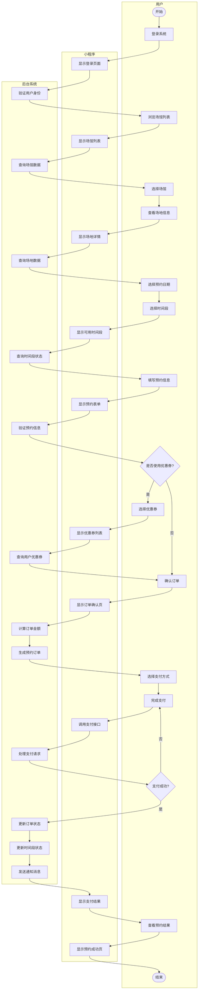
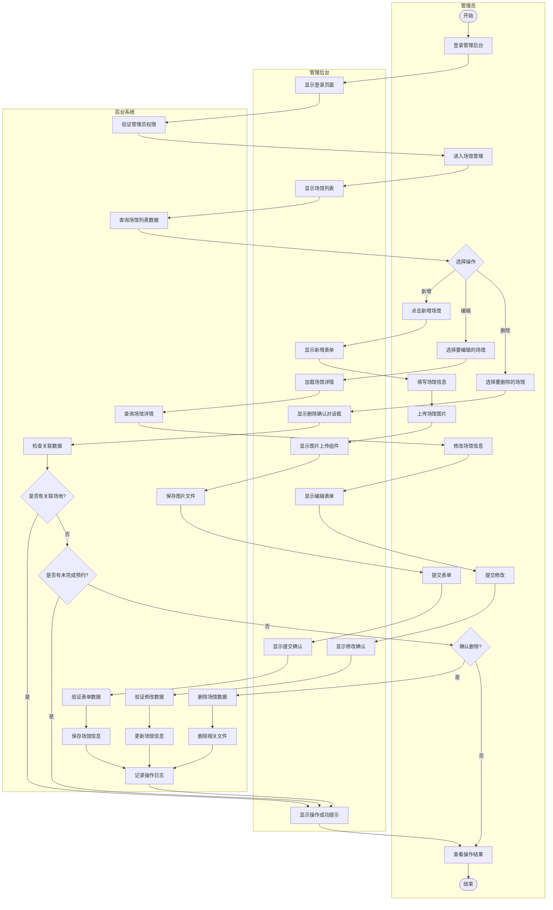
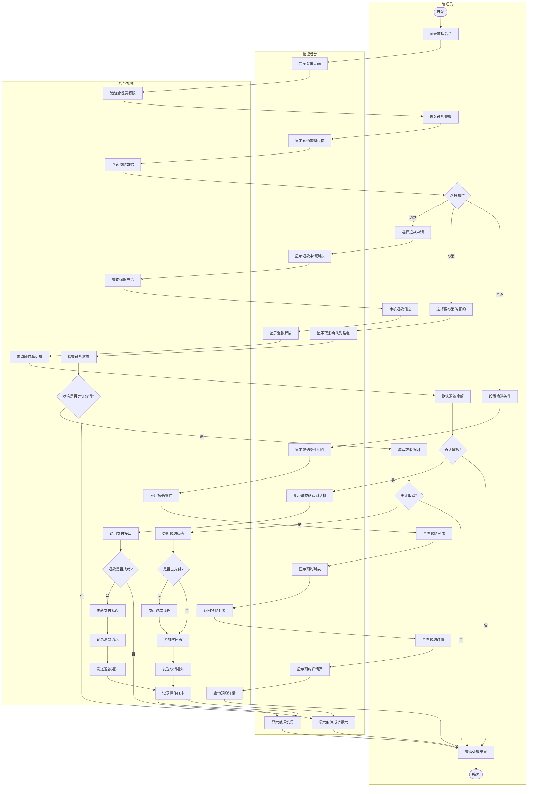

# 体育馆场地预约系统业务流程图（泳道图）

## 图3.1 用户预约场地业务流程图

## 图3.2 场馆管理业务流程图

## 图3.3 预约管理业务流程图

## 使用说明

### 泳道图说明
每个流程图都分为三个泳道（Swimlane）：
1. **用户/管理员泳道**：展示用户或管理员的操作行为
2. **小程序/管理后台泳道**：展示前端界面的交互和显示
3. **后台系统泳道**：展示后端的业务逻辑处理

### 方法1：在线渲染（推荐）
1. 访问 https://mermaid.live/
2. 复制上面的Mermaid代码
3. 粘贴到编辑器中
4. 调整样式和布局
5. 导出为PNG或SVG格式

### 方法2：使用Draw.io绘制
如果Mermaid渲染效果不理想，建议使用Draw.io手动绘制：
1. 访问 https://app.diagrams.net/
2. 选择"泳道图"模板
3. 创建三个泳道：用户/管理员、小程序/管理后台、后台系统
4. 根据Mermaid代码中的流程手动绘制

### 方法3：使用ProcessOn
1. 访问 https://www.processon.com/
2. 新建"跨职能流程图"
3. 创建三个泳道
4. 参考Mermaid代码绘制流程

### 方法4：使用Visio
1. 打开Microsoft Visio
2. 选择"跨职能流程图"模板
3. 创建三个泳道
4. 绘制完整流程

## 流程图详细说明

### 图3.1 用户预约场地业务流程图
**泳道分工：**
- **用户泳道**：用户的操作步骤，从登录到完成支付
- **小程序泳道**：小程序界面的展示和交互
- **后台系统泳道**：后端的数据处理和业务逻辑

**关键流程：**
1. 用户登录 → 身份验证
2. 浏览场馆 → 查询数据 → 展示列表
3. 选择时间 → 检查可用性 → 显示时间段
4. 填写信息 → 验证数据 → 生成订单
5. 完成支付 → 处理支付 → 更新状态

### 图3.2 场馆管理业务流程图
**泳道分工：**
- **管理员泳道**：管理员的操作步骤
- **管理后台泳道**：管理后台界面的展示
- **后台系统泳道**：后端的数据处理和权限验证

**关键流程：**
1. 新增场馆：填写信息 → 上传图片 → 保存数据
2. 编辑场馆：加载数据 → 修改信息 → 更新数据
3. 删除场馆：检查关联 → 确认删除 → 删除数据

### 图3.3 预约管理业务流程图
**泳道分工：**
- **管理员泳道**：管理员的操作步骤
- **管理后台泳道**：管理后台界面的展示
- **后台系统泳道**：后端的业务处理和状态更新

**关键流程：**
1. 查询预约：设置条件 → 筛选数据 → 展示结果
2. 取消预约：检查状态 → 填写原因 → 处理退款
3. 退款处理：审核申请 → 调用接口 → 更新状态

## 绘图建议

### 使用Draw.io绘制步骤：
1. **创建泳道**
   - 插入 → 高级 → 跨职能流程图
   - 设置3个垂直泳道
   - 命名：用户/管理员、小程序/管理后台、后台系统

2. **绘制流程**
   - 使用圆角矩形表示操作步骤
   - 使用菱形表示判断节点
   - 使用箭头连接各个节点
   - 跨泳道的箭头表示交互

3. **美化样式**
   - 统一颜色方案
   - 调整节点大小
   - 对齐元素
   - 添加图例说明

### 样式建议：
- **用户/管理员泳道**：浅蓝色背景
- **小程序/管理后台泳道**：浅绿色背景
- **后台系统泳道**：浅黄色背景
- **操作节点**：白色填充，蓝色边框
- **判断节点**：白色填充，橙色边框
- **箭头**：黑色实线，带箭头
