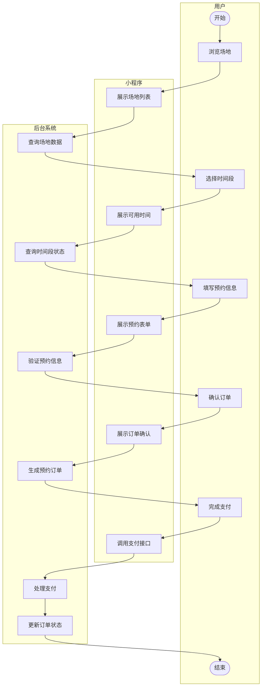
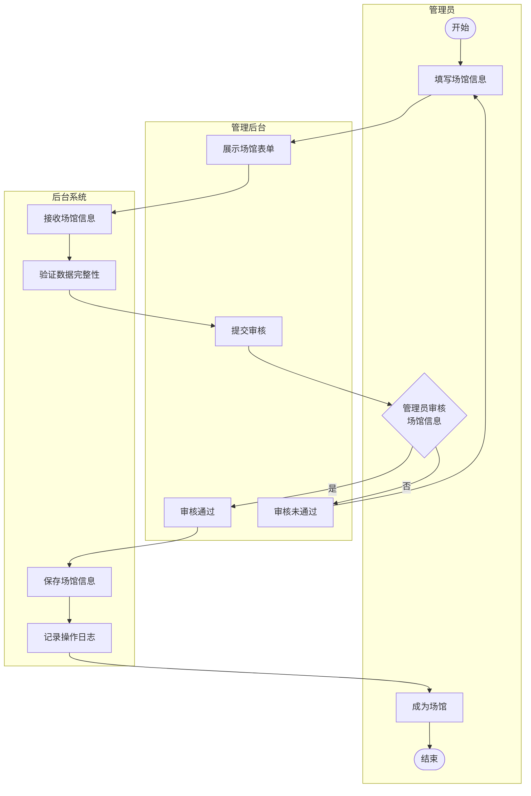
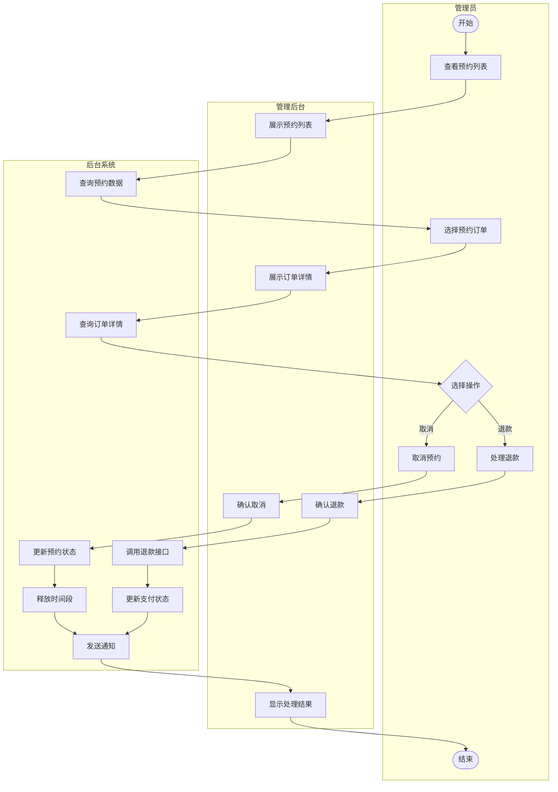

# 体育馆场地预约系统业务流程图（简化版）

## 图3.1 用户预约场地业务流程图

## 图3.2 场馆管理业务流程图

## 图3.3 预约管理业务流程图

## 使用说明

### 推荐使用Draw.io绘制

这些简化的流程图更适合手动绘制，建议使用Draw.io：

#### 步骤1：创建泳道
1. 访问 https://app.diagrams.net/
2. 新建空白图
3. 从左侧选择"泳道"形状
4. 拖入画布，创建3个垂直泳道
5. 分别命名为：用户/管理员、小程序/管理后台、后台系统

#### 步骤2：绘制流程
1. **开始/结束节点**：使用圆形（椭圆）
2. **操作步骤**：使用圆角矩形
3. **判断节点**：使用菱形
4. **连接线**：使用箭头连接各节点

#### 步骤3：美化样式
- 用户/管理员泳道：浅蓝色 (#E3F2FD)
- 小程序/管理后台泳道：浅绿色 (#E8F5E9)
- 后台系统泳道：浅黄色 (#FFF9C4)
- 节点：白色填充，深色边框
- 字体：微软雅黑，12号

### 流程图说明

#### 图3.1 用户预约场地业务流程图
**核心流程：**
1. 用户浏览场地 → 小程序展示 → 后台查询数据
2. 用户选择时间 → 小程序展示 → 后台检查状态
3. 用户填写信息 → 小程序展示 → 后台验证
4. 用户确认订单 → 小程序展示 → 后台生成订单
5. 用户完成支付 → 小程序调用 → 后台处理并更新

#### 图3.2 场馆管理业务流程图
**核心流程：**
1. 管理员填写场馆信息 → 管理后台展示表单 → 后台接收数据
2. 提交审核 → 后台验证数据
3. 管理员审核 → 通过则保存，不通过则返回修改
4. 后台记录日志，完成场馆创建

#### 图3.3 预约管理业务流程图
**核心流程：**
1. 管理员查看预约列表 → 管理后台展示 → 后台查询数据
2. 选择预约订单 → 查看详情
3. 选择操作：
   - 取消预约：更新状态 → 释放时间段 → 发送通知
   - 处理退款：调用接口 → 更新状态 → 发送通知

## 简化说明

相比之前的版本，简化了以下内容：
1. 移除了详细的异常处理分支
2. 合并了相似的操作步骤
3. 简化了判断逻辑
4. 保留了核心业务流程
5. 更符合论文中业务流程图的简洁风格

这样的流程图更清晰易懂，适合放在论文中展示核心业务逻辑。